# Madagascar Memory Game

---

## Interactive Frontend - Milestone Project 2 

Welcome to my live website [here](https://sojasmine.github.io/Madagaskar-Memory-game/).

Link to my [github pages](https://github.com/Sojasmine/Madagaskar-Memory-game).

This project is only for educational purpose.

It is a flip card memory game cartoon based upon the movie called Madagascar". This game has been designed for the user of any ages. The value of the image on the game changes belongs to the screen size.

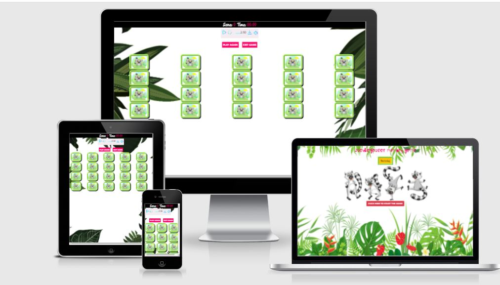

---

### Project Descritpion

This site is about a single-player memory game to test a user’s memory based on Madagascar the famous cartoon movie. The goal is to find and match a pair of cards images. It is a cool game to train user memory brain capacity. 
Memory games are good for training memory and are usually played by children but are also suitable for adults.
Based on my own proven experience, I have seen that introducing games gives children the conditions to practice their abilities for empathy and mathematical thinking. In the game memory, there is a basic structure based on turn-taking and consideration, which develops the empathic ability. Being able to see similarities and differences and talk about patterns and pairing, gives children the opportunity to develop their mathematical thinking.
This Javascript version of the memory game, using a 20 card deck for a single player.
The language used to build this project is HTML, CSS, Jquery and Javascript.

___

## Table of contents

- [UX](#ux)
   - [Project goals](#project-goals)
   - [User stories](#user-stories)
   - [Wireframes](#wireframes)
   - [Design and inspiration](#design-and-inspiration)
   - [Strategy](#strategy)
   - [Scope](#scope)
   - [Colors](#colors)
   - [Typography](#Typography)
- [Features](#features)
   - [Landing page](#landing-page)
   - [How to play](#how-to-play)
   - [Game page](#game-page)
   - [Timer](#timer)
   - [Error page](#Error-page)
   - [Features left to implement](#features-left-to-implement)
- [Technologies used](#technologies-used)
- [Testing](#testing)
   - [Project goals stories](#project-goals-stories)
   - [User stories tests](#user-stories-tests)
   - [Bugs](#bugs)
   - [Code validation](#code-validation)
   - [Performance testing](#performance-testing)
- [Deployment](#deployment)
- [Credits](#credits)
    - [Images](#images)
    - [Audio](#audio)
    - [Font](#font)
    - [Cursor](#cursor)
    - [Source of code](#cursor)
    - [Acknowledgements](#acknowledgements)
    - [License](#license)
___ 

### UX
 According to [Nielsen Norman Group](https://www.nngroup.com/), user experience is to meet the exact needs of the customer, without fuss or bother. Next comes simplicity and elegance that produce products that are a joy to own, a joy to use. True user experience goes far beyond giving customers what they say they want or providing checklist features. Total user experience is an even broader concept.

#### Project goals: 
   * User can see that the website is more appealing and well designed.
   * Player can understand the simple game instructions.
   * Player can have fun playing the game.
   * User can play anytime. 

#### User stories:
   * I want that it is easy to navigate and the website looks nice. 
   * As a game player, I want to test my brain memory with this game.
   * As a game player, I want to read a simple explanation about how to play this game.
   * As a game player, I hope that this game is funny to play and entertaining.
   * As a game player, I want to be able to play this game on a large screen.
   * As a game player. I want to be able to play this game om my mobile phone. 
   * As a game player, I want to play this game anytime.
   * As a game player, I want to see my score. 

#### Wireframes
   * I used [Balsamiq](https://balsamiq.com/) as an aid to visualize and design the website structure before starting the project development. 


[Index.html](https://documentcloud.adobe.com/link/review?uri=urn:aaid:scds:US:27c27fe8-5b7f-4574-b969-99d1d445beba)


[Game.html](https://documentcloud.adobe.com/link/review?uri=urn:aaid:scds:US:3ed9cce8-05db-4bdb-85ef-05847b32ef74)


[404](https://documentcloud.adobe.com/link/review?uri=urn:aaid:scds:US:be0af8b0-c6bf-4f3b-9761-32e871056678)

   

#### Strategy
   * I set out to make this friendly. It remembers me of my childhood as Madagascar is my homeland. And I wanted to share the happiness of being raised in a beautiful country rich in incredible nature and species. The game is just some fun for the user whether they are young or old.
   The idea of using Madagascar is quite fascinating. I made this game just for having fun by matching the pair of cards. 
#### Scope
   * The scope for me was that I want to create the feeling and sensation of watching the  Madagascar movie again and let the user remember the movie and recognize again the animals in the game. That is the reason why I choose the __lemur__ picture as the front face of the cards. Background music can be playing in the background to make this game more interesting not boring. 

#### Design and inspiration
   * I had a problem choosing a theme this time because my knowledge of Javascript is very limited and found it quite difficult. I read a lot of information and watched severals tutorial lessons on youtube. I learned a lot but still need more reading and improvement. Finally, I decided to modify a memory game. The idea behind the Madagascar cartoon come from me that this cartoon is very popular among children and even adults.
   * I was also inspired by reading some of Code Institutes students Github repositories on the __pree-code-preview__ in slack.

#### Colors
   
   * The colour scheme was chosen to tie in with the tropical flower, bright vibrant colours were selected to stand out in contract to the background but not to distract the play from the game itself.

   * The start game buttons is bootstrap primary-danger color and for the modal I used primary success.

  I used [coolors](https://coolors.co/) for the palettes.

  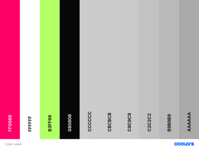
  


#### Typography]

* Ma Shan Zheng was chosen as a font-family. 
* Horn is used for the font face.
* The start game is bootstra

[Back to Table of contents](#table-of-contents)

___
### Features

#### Landing page
   * This website contains two pages. The landing page has a tropical background image, an image of lemurs in the centre of the page. The Title of the game is on the top of the page and gAme instructions modal under it. A play button under the image leads the player to the game page.

   

#### How to play
   * By clicking on the text **How to play**, modal when clicked pops up and give the user a simple instruction on how the game is meant to play. The instruction is easy to read understand for every user. 
   * The game ends when all cards are matched. User can see their speed on the panel score. 

   

#### Game page
   * Is the second page on the website. It is where the user plays the game. At top of the page, a score panel with a timer appear. 
   * An mp3 music will be played in the background during the game if wishes. There are _play sound_ and -pause sound_ buttons for the audio.
   * In the centre of the page is the game container.
   *  Users can leave the game by clicking the button _exit the game_ .
   * User can continue playing by clicking the button _play again_.

   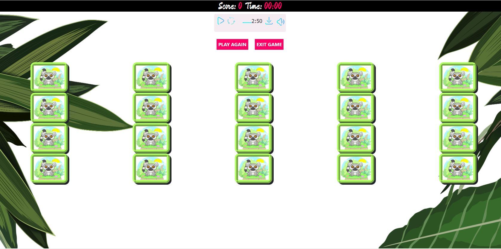

#### Timer 
   * Score panel: 
      * A timer measures the speed of the player. (It shows the time in seconds).
      * This showing the number of matched pairs of cards.

   


#### Error page
   * 404 Error ensure users to have possiblity to go back to the page thery visited.

    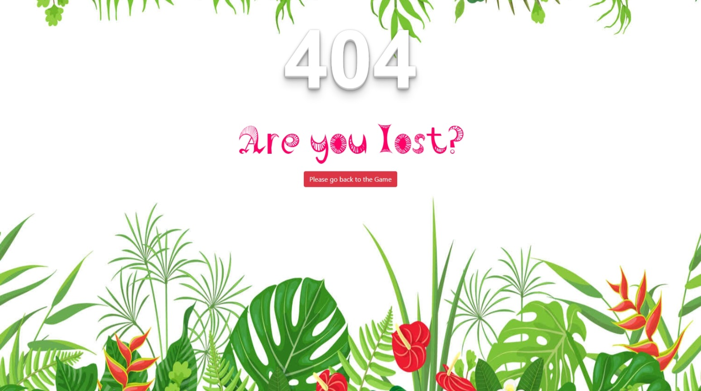

#### Features left to implement

   * The game contains 24 cards with cartoons images with bright border-radius colour. The Madagascar cartoon characters were chosen to add additional fun. All the images have the same size.  
   * It showed five grids on the large screen, four on the medium and three on the small devices. 
   * The front card has an image of a lemur that was applied as cover 

   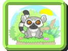


   * The tropical forest flower matches the animated images that represented the jungle. . 

   The background photos used are: 

   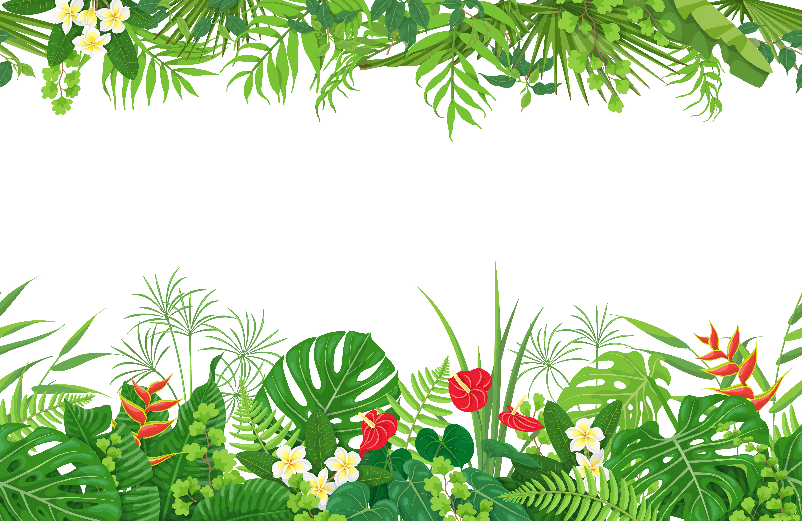


   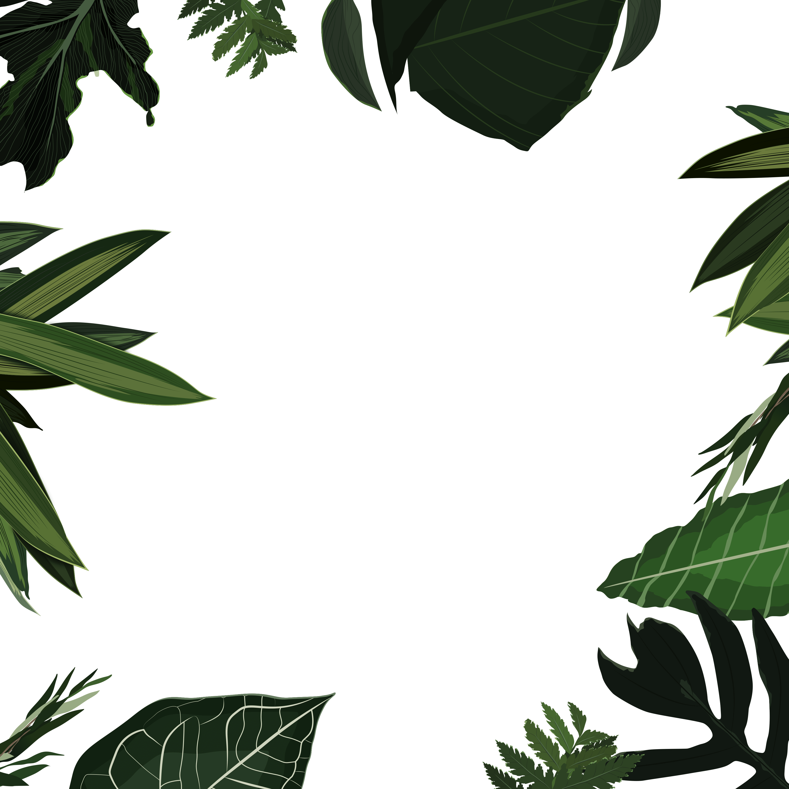


  ###### Adding difficulty levels: 
   *  To make the game fairer, I will add difficulty levels for the player.
   *  The player will have a game customize option such as: 
     * Create an account and choose an avatar.
     * Choose a username.
     * Multiple player games.
     * Challenge another player
     * Compare score with others.
     * Track game statistic. 
     * New images will be available. 

   [Back to Table of contents](#table-of-contents)

---

### Technologies used
   * HTML 5
      * The language used to create pages and add content to the website.
   * CSS 
      * The language used to style all HTML files.
   * Javascript
      * The language that makes the webpage alive.
   * Bootstrap
      * For responsiveness
   * Github
      * Repository hosting service and a location where all the files for a particular project are stored. I can access my unique URL in Github.
   * Gitpod
      * Code source developper plattform. 
   * GIT
      * Version control to record changes and updates files.
   * Font awesome
      * Where I can search for icon and toolkit.  
   * JQuery
      * A javascript library. 
   

___

### Testing

#### Project goals stories 
   * User can see that the website is more appealing and well designed.
   > Simple design, easy to understand with colourful images.
   * Player can understand the simple game instructions.
   > Easy and short explanation for the user to understand on the landing page.
   * Player can have fun playing the game.
   > Nice cartoon images are available on the landing and game pages. User can listen to music too.  
   * User can play anytime.
   > No need to make a registration. User can simply click on the play button and enjoy the game. 

#### User stories tests
   * I want that it is easy to navigate and the website to look nice.  
   > User can play by clicking on the *Click here to start*.  

   


   > User can see that there are images and colourful  contents. 
   * As a game player, I want to test my brain memory with this game.
   > User can try to remember cards position by flipping and matching pair of cards around the cards board on the game page. 
   * As a game player, I want to read a simple explanation about how to play this game.
   > The user needs to understand the main goal of the game. The instructions are very easy and simple to understand.

   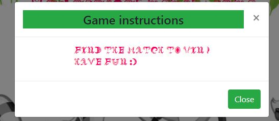


   * As a game player, I hope that this game is funny to play and entertaining.
   > User can find funny cartoon images. There are images both on the front and back of the cards. 

   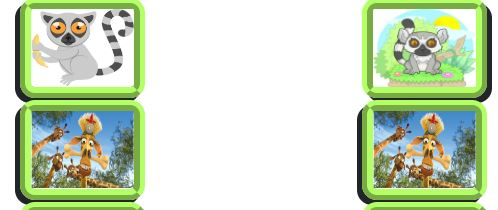


   * As a game player, I want to be able to play this game on a large screen.
   > User can play this game on any desktop and tablets screen.

     * Ipad

   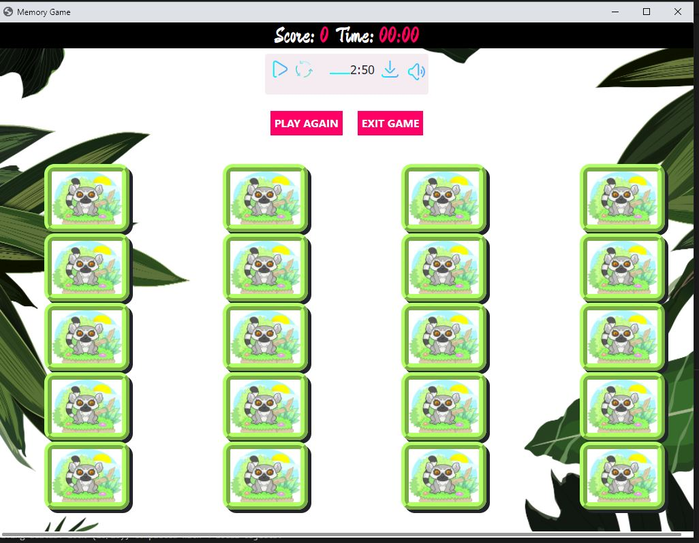


   * As a game player. I want to be able to play this game om my mobile phone. 
    
    * Iphone 7

   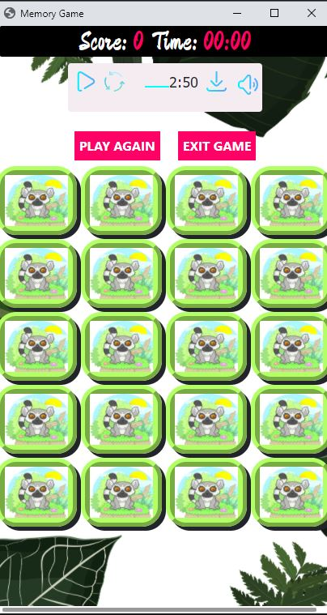


   * Iphone 5

   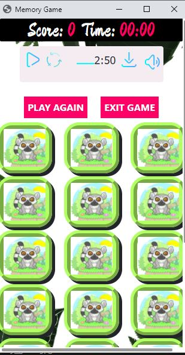


  * Blackberry landscape


   


 
   * As a game player, I want to play this game anytime.
   > User can come back and play this game again and again without login in. 

   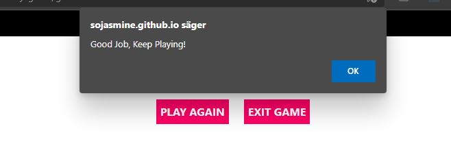
   > No need for registration, just click the button and start playing.

   * As a game player, I want to see my score. 
   > User can see their speedity when all pairs found. 


   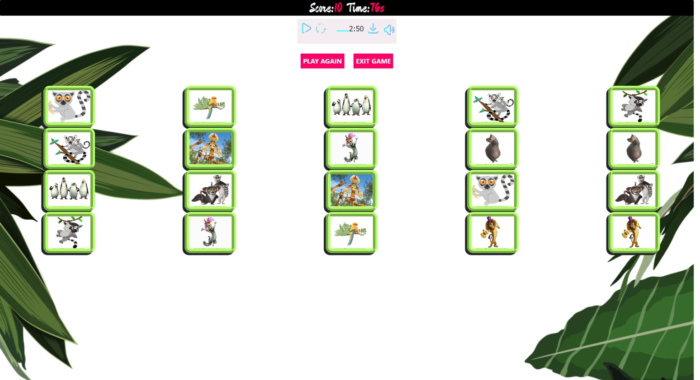
   

   * Test result from real user: 


   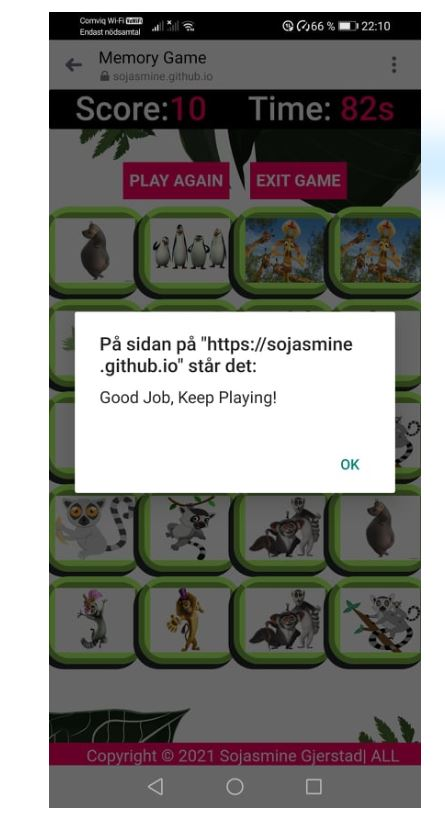


   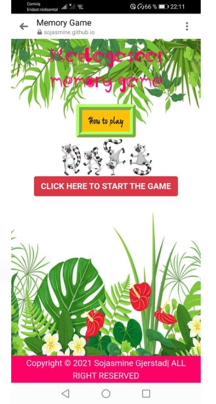
   

#### Bugs

   * Problem with cards shuffling. The math Random is not working. 

   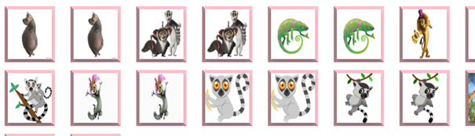

   > Solved it by using a code snippet from [css tricks](https://css-tricks.com) 


   Link to the [code](https://css-tricks.com/snippets/jquery/shuffle-dom-elements/)

   * Warnings from [jshint](https://jshint.com/) about ES6.

   > Solved it by adding a **/*jshint esversion: 6 */** comment in the top of my javscript file. 

   * Problem with responsivness. The game was not mobile friendly, it is working fine on the desktop and tablets but not for mobile. 
   > After many attempt to solve the problem, I asked for help from tutors. 
   > I got a tips to wathc this [Youtube](https://www.youtube.com/watch?v=_-aDOAMmDHI) video. 
   > I used those methods to figure out how **vw** , **rem** and **em** are working: 
   

   [Nekocalc](https://nekocalc.com/)


   [Code Beautify](https://codebeautify.org/)


   [W3 Schools](https://www.w3schools.com/css/css_rwd_mediaqueries.asp)


   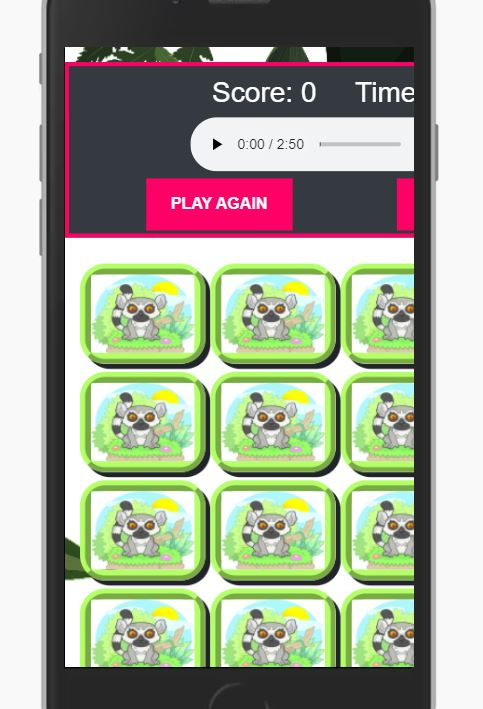


   * Problem centring the audio tag
   > I tried multiple code to force the audio to be in the center with no lack. I googled tips but it was hard to find. 

   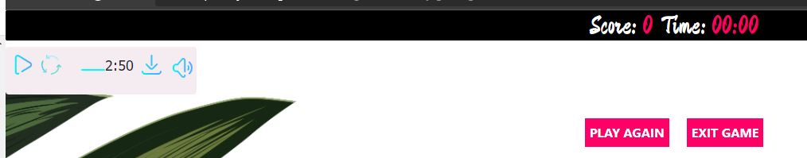


   >Finally I found this solution from [Stackoverflow](https://stackoverflow.com/questions/55126972/how-to-centre-center-html-audio-player-to-middle-of-webpage) .

   I choosed the attempt number nine on the page.


   * Javascript error

        
   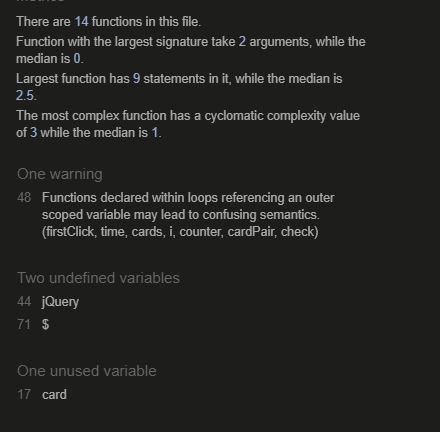


   > I have no idea how to solve the warning. 


#### Code validation

   * I used [W3C](https://validator.w3.org/) to validate HTML code.

   > Final result: No warning to show.

   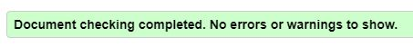


   * I used [Jigsaw](https://jigsaw.w3.org/css-validator/) to validate CSS code.

   > Final result: No warning to show.

    


   * I used [Jshint](https://jshint.com/) to validate Javscript.

   > 1 warnings, not solved. 


   * I used [Ami Responsive](http://ami.responsivedesign.is/) and [Google Responsive Web Design tester](https://chrome.google.com/webstore/search/responsive%20web%20design%20tester?hl=sv)to controll responsiveness of the website. 
   


#### Performance testing
   
   * I used [lighthouse](https://developer.chrome.com/) to generate report peformance

   Final result: 
   

   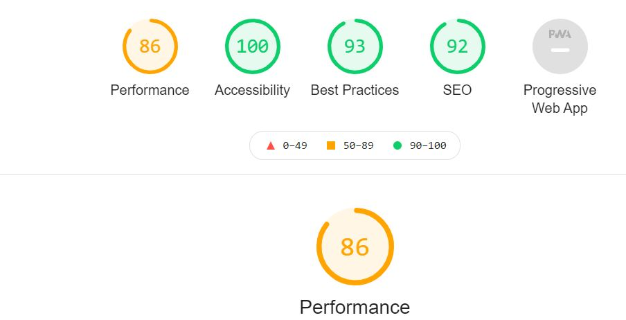


   [Back to Table of contents](#table-of-contents)


   * Desktop testing: 

   The site was tested in MSI and Lenovo laptop.

   The website was tested on Firefox, Microsoft Edge and google chrome.

   * Real devices testing: 
 
      * A tablet.
      * A motorola
      * Iphone
      * Nokia
      * Samsung
      * Huawei P30


____

## Deployment
  * Log into GitHub. 
1. Make sure you use VScode at your Gitpod account. 
1. To deploy this page to GitHub Pages from your Code Institute [template](https://github.com/Code-Institute-Org/gitpod-full-template)
1. Create a repository. 
1. From the menu items near the top of the page, select **Settings**.
1. Scroll down to the **GitHub Pages** section.
1. Under **Source** click the drop-down menu labelled **None** and select **Master Branch**
1. On selecting Master Branch the page is automatically refreshed, the website is now deployed. 
1. Make sure to click the save button. 
1. Scroll back down to the **GitHub Pages** section to retrieve the link to the deployed website.

### How to run this project locally

  * To clone this project from GitHub:
1. At the top of this repository, click the green button **Clone or download**.
1. In the Clone with HTTP section, copy the clone URL for the repository. 
1. Open your favourite terminal (cmd, Powershell, bash, git bash, etc.)
1. Change the current working directory to the location where you want the cloned directory to be made.
1. Type `git clone`, and then paste the URL you copied in Step 2.
```console
git clone https://github.com/Eventyret/vscode-bcdn.git
```
1. Press Enter. Your local clone will be created.

  [Back to Table of contents](#table-of-contents)

___

### Credits
   #### Images

   * Free downloading of those images was taken from [wallpaperaccess](https://wallpaperaccess.com/) 

       Link to the image: [Cartoon](https://wallpaperaccess.com/madagascar-cartoon) : 

       - floodhest.jpg
       - fosa.jpg
       - giraf.jpg
       - lion.jpg
       - make.jpg
       - pinguin.jpg

   * Background image for the landing page was taken from [123rf](https://www.123rf.com/)

       Link to the image: [jungle1](https://www.123rf.com/photo_90244905_horizontal-floral-seamless-pattern-made-with-colorful-leaves-and-flowers-of-tropical-plants-on-white.html?vti=ln5bbq0knfcckp3mzo-1-1)


   * Background from the game page was taken for free from [pixabay](https://pixabay.com/sv/illustrations/l%c3%b6vverk-golv-natur-v%c3%a5r-djungel-4128742/)
   
   * Those images were taken from [shutterstock]

   [maki.jpg](https://www.shutterstock.com/sv/image-vector/cute-cartoon-funny-sitting-lemur-banana-1038744010)

   [lemur7.jpg](https://www.shutterstock.com/sv/image-vector/cartoon-little-cute-lemur-went-walk-1649848858)

   [makoa.jpg](https://www.shutterstock.com/sv/image-vector/cute-lemur-cartoon-487784320)

   [maka.jpg](https://www.shutterstock.com/sv/image-vector/lemur-family-love-illustration-vector-nursery-1637518393)

   [papegoja](https://www.shutterstock.com/sv/image-illustration/exotic-colorful-parrot-palm-monstera-leaves-1937076736)

   [lemuro1.jpg](https://www.shutterstock.com/sv/image-vector/illustration-set-lemurs-102916832)


   

   #### Audio

   * The background music from [Youtube](https://www.youtube.com/watch?v=hdcTmpvDO0I&t=17s) converted to mp3.
      
   #### Font
   * Font used for the page title was borrowed from [fontspace](https://www.fontspace.com/horn-font-f13906)
        - Horn font.

   #### Cursor
   * Free cursor from [rw-designer](http://www.rw-designer.com/gallery?search=lemur+cursors)

   #### Source of code

   * Modal on the index.html was taken from [bootstrap](https://getbootstrap.com/)

   * Modified code for this project from codeTonight [yotube](https://www.youtube.com/watch?v=QrTCHHhoUQU)

   * Code for the audito tag was takem from [Audio](https://www.youtube.com/watch?v=L5gFnaTItmE&list=PL4qBeMvI9dekyxjnFQLyWZtgMM20RQ_T6&index=92)  and https://stackoverflow.com/questions/55126972/how-to-centre-center-html-audio-player-to-middle-of-webpage

   * Code for the responsivness from [Youtube](https://www.youtube.com/watch?v=_-aDOAMmDHI)

   *[Shuffle Code](https://css-tricks.com/snippets/jquery/shuffle-dom-elements/)

   * Code for 404 page[Codepen](https://codepen.io/ThatGuySam/pen/CytDA)
      
   #### Acknowledgements

   * I would like to thank my mentor Adegbenga Adeye for his patient and understanding. 

   * Great thanks to Code Institute tutors Igor Ci, Michael and John Trass for their support and advices.

   * I wanna thanks [codeTonight](https://www.youtube.com/channel/UCpb06fTkt2lx5qjEIocmZCg)

   * I would like to thank some student from Code Institute for tips and advice. 

   * I  wanna thanks my family for their support during the last tough weeks for their encouragement.
   
   #### License

   * [License agreement](https://www.123rf.com/license.php#standard) for the background image on the landing page. 

   - I signed up for 30 days free trial on this site. 

   * [License agreement](https://www.shutterstock.com/) for some of the cards images.

   - I signed up for 30 days free trial on this site.

   [Back to Table of contents](#table-of-contents)

   ___

   Sojasmine Gjerstad: Student at Code intsitute.

   [github page](https://github.com/Sojasmine/Madagaskar-Memory-game)

   [Website](https://sojasmine.github.io/Madagaskar-Memory-game/)

   September © 2021


 


