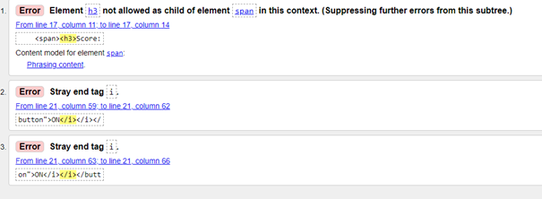
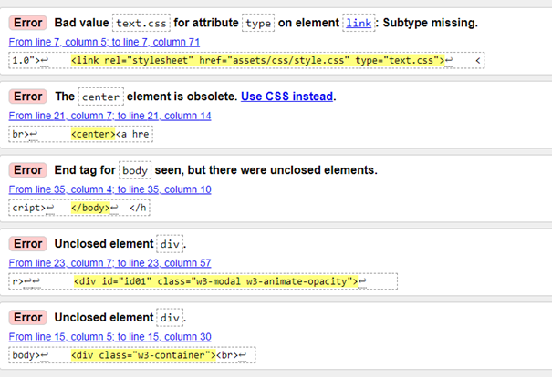
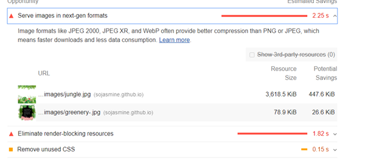

# Madagascar Memory Game

---

## Interactive Frontend - Milestone Project 2 

Welcome to my live website [here](https://sojasmine.github.io/Madagaskar-Memory-game/).

Link to my [github pages](https://github.com/Sojasmine/Madagaskar-Memory-game).

This project is only for educational purpose.

This game is not mobile friendly. It is optimised to desktop and Ipadpro screen only. 

(screen devices images here)

---

### Project Descritpion

This site is about a single-player memory game to test a user’s memory based on Madagascar the famous cartoon movie. The goal is to find and match a pair of cards images. It is a cool game to train user memory brain capacity. 
Memory games are good for training memory and are usually played by children but are also suitable for adults.
Based on my own proven experience, I have seen that introducing games gives children the conditions to practice their abilities for empathy and mathematical thinking. In the game memory, there is a basic structure based on turn-taking and consideration, which develops the empathic ability. Being able to see similarities and differences and talk about patterns and pairing, gives children the opportunity to develop their mathematical thinking.
This Javascript version of the memory game, using a 20 card deck for a single player.
The language used to build this project is HTML, CSS , Jquery and Javascript.

___

## Table of contents

- [UX](#ux)
   - [Project goals](#project-goals)
   - [User stories](#user-stories)
   - [Wireframes](#wireframes)
   - [Design and inspiration](#design-and-inspiration)
   - [Strategy](#strategy)
   - [Scope](3scope)
   - [Colors](#colors)
- [Features](#features)
   - [Landing page](#landing-page)
   - [How to play](#how-to-play)
   - [Game page](#game-page)
   - [Timer](#timer)
   - [Score](#score)
   - [Features left to implement](#features-left-to-implement)
- [Technolgies used](#technoligies-used)
- [Testing]
   - [Project goals stories](#project-goals-stories)
   - [User stories tests](#user-stories-tests)
   - [Bugs](#bugs)
   - [Code validation](code-validation)
   - [Performance testing](#perfomance-testing)
- [Deployment](#deployement)
- [Credits](#credits)
    - [Images](#images)
    - [Audio](#audio)
    - [Font](#font)
    - [Cursor](#cursor)
    - [Source of code](#cursor)
    - [Acknowledgements](#acknowledgements)
    - [License](#license)
___ 

### UX
 According to [Nielsen Norman Group](https://www.nngroup.com/), user experience is to meet the exact needs of the customer, without fuss or bother. Next comes simplicity and elegance that produce products that are a joy to own, a joy to use. True user experience goes far beyond giving customers what they say they want or providing checklist features. Total user experience is an even broader concept.

#### Project goals: 
   * User can see that the website is more appealing and well designed.
   * Player can understand the simple game instructions.
   * Player can have fun playing the game.
   * User can play anytime. 

#### User stories:
   * I want that it is easy to navigate and the website looks nice. 
   * As a game player, I want to test my brain memory with this game.
   * As a game player, I want to read a simple explanation about how to play this game.
   * As a game player, I hope that this game is funny to play and entertaining.
   * As a game player, I want to be able to play this game on a large screen.
   * As a game player, I want to play this game anytime.

#### Wireframes
   * I used [Balsamiq](https://balsamiq.com/) as an aid to visualize and design the website structure before starting the project development. 
   [My wireframes](link till adobe)

#### Strategy
   * I set out to make this friendly. It remembers me of my childhood as Madagascar is my homeland. And I wanted to share the happiness of being raised in a beautiful country rich in incredible nature and species. The game is just some fun for the user whether they are young or old.
   The idea of using Madagascar is quite fascinating. I made this game just for having fun by matching the pair of cards. 
#### Scope
   * The scope for me was that I want to create the feeling and sensation of watching the  Madagascar movie again and let the user remember the movie and recognize again the animals in the game. That is the reason why I choose the __lemur__ picture as the front face of the cards. Background music can be playing in the background to make this game more interesting not boring. 

#### Design and inspiration
   * I had a problem choosing a theme this time because my knowledge of Javascript is very limited and found it quite difficult. I read a lot of information and watched severals tutorial lessons on youtube. I learned a lot but still need more reading and improvement. Finally, I decided to modify a memory game. The idea behind the Madagascar cartoon come from me that this cartoon is very popular among children and even adults.
   * I was also inspired by reading some of Code Institutes students Github repositories on the __pree-code-preview__ in slack.

#### Colors
   * Landing page: 
      * page-title:  #ff3300;

      * background-color for headings: rosybrown;

   * Game page: 
    
     * Html background-color: hsl(180, 100%, 90%);

     * Game container background-color: transparent;

     * Memory card background-color:  rgb(255, 204, 255);

     * Border color for card back: #32a1ce;

     * Text-color in the border: red;

     * Button color: rgb(184, 28, 150);

     * Border color: #99ff33;

     

[Back to Table of contents](#table-of-contents)

___
### Features

#### Landing page
   * This website contains 2 pages. The landing page contains a tropical background image, an image of lemurs in the centre of the page. Title of the game on the top. Instruction about how to play and a play button that leads to the game page with text inside an image on it. 

#### How to play
   * By clicking on the text **How to play**, modal when clicked pops up and give the user a simple instruction on how the game is meant to play. The instruction is easy to read understand for every user. 
   * The objective of the memory game is for the player to flip over pairs of cards and select two cards whose symbols  match.
     The game ends when all the pairs cars are matched.

#### Game page
   * Is the second page in the website. It is where the user play the game. In top of the page, a score panel with timer appear. 
   * An mp3 music will be played in the background during the game if wishes. There are two ON and OFF button for the audio.
   * In the center of the page is the game container.
   * When the user matches the pair of cards successfully, a small window with a congratulation page will show up with the player duration time speed. 

     The user can try a new game by clicking the button __play again__ or __leave__ the game back to the landing page.
    (leave and a play again button, this is an option) (In the bottom there is a small text for mail and a license info)

#### Timer 
   * A timer measure the speedity of the palyer.

#### Score
  * This showing the number of matched pairs of cards.

#### Features left to implement
  * Adding difficulty levels: 
     * To make the game more fair, I will add difficulty levels for the player.

  * The player will have a game customize option such as: 
     * Create an account and choose an avatar.
     * Choose a username.
     * Multiple player game.
     * Challenge another player
     * Compare score with others.
     * Track game statistic. 
     * New images will be available. 

    [Back to Table of contents](#table-of-contents)
---

### Technologies used
   * HTML
   * CSS
   * Javascript
   * Bootstrap
   * Github
   * Gitpod
   * GIT
   * Font awesome
   * JQuery
   

___

### Testing
   
#### Project goals stories 
   * The website has the technology to automatically respond to the user’s preferences.
   > User can play the game on any screen devices. 
   * User can see that the website is more appealing and well designed.
   > Simple design, easy to understand with colorful images.
   * Player can understand the simple game instructions.
   > Easy and short explanation for the user to understand on the landing page.
   * Player can have fun playing the game.
   > Nice cartoon images are available on the landing and game pages. User can listen to music too.  
   * User can play anytime.
   > No need to make a registration. User can simply click on the play button and enjoy the game. 

#### User stories tests
   * I want that it is easy to navigate and the webiste looks nice. 
   > User can play by clicking on the *Let's play button*.  
   > User can see that there are images and colorful contents. 
   * As a game player, I want to test my brain memory with this game.
   > User can try to remember cards position by flipping and matching pair of cards around the cards board on the game page. 
   * As a game player, I want to read a simple explanation about how to play this game.
   > The user needs to understand the main goal of the game. The instructions are very easy and simple to understand.
   * As a game player, I hope that this game is funny to play and entertaining.
   > User can find funny cartoon images. There are images both on the front and back of the cards. 
   * As a game player, I want to be able to play this game on any devices.
   > User can play this game on any devices. 
   * As a game player, I want to play this game anytime.
   > User can come back and play this game again and again without login in. 
   > No need for registration, just click the button and start playing.

#### Bugs
   * Problem with cards shuffling. The math Random is not working. 
   

   * Problem with responsiveness on the game page.
   

   * Warnings from [jshint](https://jshint.com/) about ES6.
   > Solved it by adding a **/*jshint esversion: 6 */** comment in the top of my javscript file. 

   * HTML validating error.
   

   

   * Javascript error report 
   

#### Code validation

   * I used [W3C](https://validator.w3.org/) to validate HTML code.
   * I used [Jigsaw](https://jigsaw.w3.org/css-validator/) to validate CSS code.
   * I used [Jshint](https://jshint.com/) to validate Javscript.
   * I used [Ami Responsive](http://ami.responsivedesign.is/) to controll responsiveness of the website. 

#### Performance testing
   
   * I used [lighthouse](https://developer.chrome.com/) to generate report peformance

   

   Final result: 


   ( performance result here)(fill later not yet finished)

   [Back to Table of contents](#table-of-contents)
____

## Deployment
  * Log into GitHub. 
1. Make sure you use VScode at your Gitpod account. 
1. To deploy this page to GitHub Pages from your Code Institute [template](https://github.com/Code-Institute-Org/gitpod-full-template)
1. Create a reposirtory. 
1. From the menu items near the top of the page, select **Settings**.
1. Scroll down to the **GitHub Pages** section.
1. Under **Source** click the drop-down menu labelled **None** and select **Master Branch**
1. On selecting Master Branch the page is automatically refreshed, the website is now deployed. 
1. Make sure to click the save button. 
1. Scroll back down to the **GitHub Pages** section to retrieve the link to the deployed website.

### How to run this project locally

  * To clone this project from GitHub:
1. At the top of this repository, click the green button **Clone or download**.
1. In the Clone with HTTPs section, copy the clone URL for the repository. 
1. Open your favourite terminal (cmd, powershell, bash, git bash, etc.)
1. Change the current working directory to the location where you want the cloned directory to be made.
1. Type `git clone`, and then paste the URL you copied in Step 2.
```console
git clone https://github.com/Eventyret/vscode-bcdn.git
```
1. Press Enter. Your Your local clone will be created.

  [Back to Table of contents](#table-of-contents)

___

### Credits
   #### Images

   * Free downloading of those image was taken from [wallpaperaccess](https://wallpaperaccess.com/) 

       Link to the image: [Cartoon](https://wallpaperaccess.com/madagascar-cartoon) : 

       - floodhest.jpg
       - fosa.jpg
       - giraf.jpg
       - lion.jpg
       - make.jpg
       - pinguin.jpg

   * Background image for the landing page was taken from [123rf](https://www.123rf.com/)

       Link to the image: [jungle1](https://www.123rf.com/photo_90244905_horizontal-floral-seamless-pattern-made-with-colorful-leaves-and-flowers-of-tropical-plants-on-white.html?vti=ln5bbq0knfcckp3mzo-1-1)

   * Animated background image was taken from [codepen](https://codepen.io/) . As a member of the site, I have a right to use images. 

       Link to the image: [Animated background](https://codepen.io/carpenumidium/full/vNNzyG)

   * Free downloading of modal background image was taken from [pixabay](https://pixabay.com/) . I added text content by using Paint 3D on my computer.

      link to the image: [greenery-.jpg](https://pixabay.com/sv/illustrations/gr%C3%B6nska-l%C3%B6vverk-tropiska-exotiska-4407910/)
   
   * 
   

   #### Audio

      * The background music from [Youtube]() converted to mp3.
      * The victory music from [Youtobe]() converted to mp3. 
   #### Font
      * Font used for the page title was borrowed from [fontspace](https://www.fontspace.com/horn-font-f13906)
   #### Cursor
   #### Source of code
      * Modal on the index.html was taken from [w3 schools](https://www.w3schools.com/w3css/tryit.asp?filename=tryw3css_modal_fade)

      * Modified code for this project from codeTonight [yotube](https://www.youtube.com/watch?v=QrTCHHhoUQU)

      * Javascript code for the audio was taken from [w3 schools](https://www.w3schools.com/) : 
        
        - [code](https://www.w3schools.com/jsreF/tryit.asp?filename=tryjsref_audio_pause)

      * Shuffle code was taken from...
      
   #### Acknowledgements
   #### License

       * [License agreement](https://www.123rf.com/license.php#standard) for the background image on the landing page. 
       - I signed up for 30 days free trial on this site. 

       * [License agreement]() for some of the cards images.
       - I signed up for 30 days free trial on this site.

   


   ### Author

   Sojasmine Gjerstad: Student at Code intsitute.
   [github page](https://github.com/Sojasmine/Madagaskar-Memory-game)
   [Website](https://sojasmine.github.io/Madagaskar-Memory-game/)

   Maj © 2021


 


